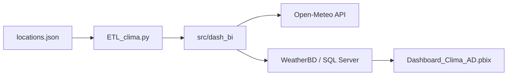
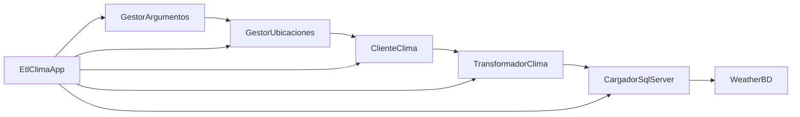

# Dash BI Clima

Proyecto de integración de datos meteorológicos con `Python + SQL Server + Power BI` para consultar información de Open-Meteo, almacenarla en una base local y visualizarla en un dashboard analítico.

## Descripción

El proyecto está compuesto por tres partes principales:

1. Un proceso ETL en Python para consumir la API de Open-Meteo.
2. Una base de datos SQL Server para almacenar países, zonas horarias, ubicaciones y series climáticas.
3. Un dashboard de Power BI para explorar los datos cargados.

La versión actual del ETL fue refactorizada a una estructura modular orientada a objetos, separando responsabilidades para mejorar mantenimiento, lectura y pruebas.

## Arquitectura General



## Estructura del Proyecto

```text
Dash_BI/
├── Dashboard_Clima_AD.pbix
├── ETL_clima.py
├── README.md
├── requirements.txt
├── WeatherDB.sql
├── locations.json
├── src/
│   └── dash_bi/
│       ├── __init__.py
│       ├── api/
│       │   ├── __init__.py
│       │   └── cliente_clima.py
│       ├── aplicacion/
│       │   ├── __init__.py
│       │   └── etl_clima_app.py
│       ├── catalogo/
│       │   ├── __init__.py
│       │   └── gestor_ubicaciones.py
│       ├── config/
│       │   ├── __init__.py
│       │   └── gestor_argumentos.py
│       ├── modelos/
│       │   ├── __init__.py
│       │   └── ubicacion_consulta.py
│       ├── persistencia/
│       │   ├── __init__.py
│       │   └── cargador_sql_server.py
│       └── transformacion/
│           ├── __init__.py
│           └── transformador_clima.py
└── tests/
    ├── __init__.py
    ├── test_argumentos.py
    ├── test_catalogo.py
    ├── test_etl.py
    └── test_transformacion.py
```

## Explicación de Módulos

### Archivo principal

- [ETL_clima.py](/C:/Users/d3smo/Desktop/CUC/Almacenes%20de%20datos/Dash_BI/ETL_clima.py)
  - Punto de entrada del proyecto.
  - Inicializa la aplicación ETL y delega la ejecución al flujo principal.

### Configuración

- [gestor_argumentos.py](/C:/Users/d3smo/Desktop/CUC/Almacenes%20de%20datos/Dash_BI/src/dash_bi/config/gestor_argumentos.py)
  - Captura y organiza los parámetros de consola.
  - Define opciones como `--location`, `--all-locations`, `--coordinates`, `--server` y `--request-delay`.

### Catálogo de ubicaciones

- [gestor_ubicaciones.py](/C:/Users/d3smo/Desktop/CUC/Almacenes%20de%20datos/Dash_BI/src/dash_bi/catalogo/gestor_ubicaciones.py)
  - Carga y valida el archivo `locations.json`.
  - Resuelve ubicaciones desde catálogo o coordenadas manuales.
  - Soporta coordenadas simples y detalladas.

### Modelos

- [ubicacion_consulta.py](/C:/Users/d3smo/Desktop/CUC/Almacenes%20de%20datos/Dash_BI/src/dash_bi/modelos/ubicacion_consulta.py)
  - Representa una ubicación lista para consultar.
  - Contiene ciudad, país, zona horaria, latitud y longitud.

### Cliente de API

- [cliente_clima.py](/C:/Users/d3smo/Desktop/CUC/Almacenes%20de%20datos/Dash_BI/src/dash_bi/api/cliente_clima.py)
  - Construye URLs de Open-Meteo.
  - Ejecuta las peticiones HTTP.
  - Expone las columnas diarias y horarias utilizadas por el ETL.

### Transformación

- [transformador_clima.py](/C:/Users/d3smo/Desktop/CUC/Almacenes%20de%20datos/Dash_BI/src/dash_bi/transformacion/transformador_clima.py)
  - Convierte fechas y horas del payload.
  - Prepara filas diarias y horarias listas para insertar en SQL Server.
  - Divide listas en lotes para facilitar operaciones por bloques.

### Persistencia

- [cargador_sql_server.py](/C:/Users/d3smo/Desktop/CUC/Almacenes%20de%20datos/Dash_BI/src/dash_bi/persistencia/cargador_sql_server.py)
  - Construye la conexión a SQL Server.
  - Inserta países, zonas horarias y ubicaciones.
  - Inserta unidades.
  - Inserta filas diarias y horarias.

### Aplicación ETL

- [etl_clima_app.py](/C:/Users/d3smo/Desktop/CUC/Almacenes%20de%20datos/Dash_BI/src/dash_bi/aplicacion/etl_clima_app.py)
  - Orquesta el flujo completo del proceso ETL.
  - Integra argumentos, catálogo, API, transformación y persistencia.

### Pruebas

- [tests](/C:/Users/d3smo/Desktop/CUC/Almacenes%20de%20datos/Dash_BI/tests)
  - Incluye pruebas base para:
    - parsing de coordenadas
    - carga de catálogo
    - transformación de payloads
    - construcción de URLs

## Flujo ETL



### Resumen del flujo

1. Se leen los argumentos de consola.
2. Se carga el catálogo JSON o se interpretan coordenadas manuales.
3. Se construye la URL para Open-Meteo con la zona horaria correcta.
4. Se consulta la API.
5. Se transforma la respuesta en filas diarias y horarias.
6. Se insertan o actualizan catálogos y tablas de clima en SQL Server.
7. El dashboard de Power BI consume la base de datos resultante.

## Modelo de Datos

La base de datos separa país, zona horaria, ubicación y observaciones meteorológicas:

```mermaid
erDiagram
    Country {
        int CountryID PK
        nvarchar CountryName UK
    }

    Timezone {
        int TimezoneID PK
        nvarchar TimezoneName UK
        nvarchar TimezoneAbbreviation
    }

    Location {
        int LocationID PK
        nvarchar CityName
        int CountryID FK
        int TimezoneID FK
        decimal Latitude
        decimal Longitude
        float GenerationTimeMs
        float Elevation
        datetime2 CreatedAt
    }

    DailyUnits {
        int UnitID PK
        nvarchar FieldName UK
        nvarchar UnitSymbol
    }

    HourlyUnits {
        int UnitID PK
        nvarchar FieldName UK
        nvarchar UnitSymbol
    }

    DailyWeather {
        bigint DailyWeatherID PK
        int LocationID FK
        date Date
    }

    HourlyWeather {
        bigint HourlyWeatherID PK
        int LocationID FK
        datetime2 Timestamp
    }
    
    
    
    Country ||--o{ Location : has
    Timezone ||--o{ Location : uses
    Location ||--o{ DailyWeather : contains
    Location ||--o{ HourlyWeather : contains    
 ```

Relaciones en el modelo:

- `Country[CountryID] -> Location[CountryID]`
- `Timezone[TimezoneID] -> Location[TimezoneID]`
- `Location[LocationID] -> DailyWeather[LocationID]`
- `Location[LocationID] -> HourlyWeather[LocationID]`


## Requisitos

- Python 3.10 o superior
- SQL Server local o remoto
- Driver ODBC para SQL Server
- Power BI Desktop

Instalación de dependencias:

```bash
pip install -r requirements.txt
```

## Configuración de Base de Datos

1. Abre [WeatherDB.sql](/C:/Users/d3smo/Desktop/CUC/Almacenes%20de%20datos/Dash_BI/WeatherDB.sql) en SQL Server Management Studio.
2. Ejecuta el script para crear la base `WeatherBD`.

## Catálogo de Ubicaciones

El archivo [locations.json](/C:/Users/d3smo/Desktop/CUC/Almacenes%20de%20datos/Dash_BI/locations.json) contiene entradas con esta estructura:

```json
{
  "san_jose_cr": {
    "city": "San Jose",
    "country": "Costa Rica",
    "timezone": "America/Costa_Rica",
    "latitude": 9.9281,
    "longitude": -84.0907
  }
}
```

Campos requeridos:

- `city`
- `country`
- `timezone`
- `latitude`
- `longitude`

## Ejecución

### Listar ubicaciones

```bash
python ETL_clima.py --list-locations
```

### Cargar todas las ubicaciones del catálogo

```bash
python ETL_clima.py --all-locations
```

### Cargar ubicaciones específicas

```bash
python ETL_clima.py --location san_jose_cr,berlin,madrid_es
```

### Cargar coordenadas manuales en formato simple

```bash
python ETL_clima.py --coordinates "9.9281,-84.0907;48.8566,2.3522"
```

### Cargar coordenadas manuales en formato detallado

```bash
python ETL_clima.py --coordinates "lat=9.9281,lon=-84.0907,city=San Jose,country=Costa Rica,timezone=America/Costa_Rica"
```

### Cambiar rango de consulta

```bash
python ETL_clima.py --all-locations --past-days 30 --forecast-days 7
```

### Usar otra instancia de SQL Server

```bash
python ETL_clima.py --server .\\SQLEXPRESS --database WeatherBD
```

### Usar autenticación SQL

```bash
python ETL_clima.py --server localhost --database WeatherBD --username sa --password TuClave
```

## Parámetros Principales

- `--all-locations`: procesa todas las ubicaciones del catálogo.
- `--location`: procesa una o varias claves del JSON.
- `--coordinates`: permite coordenadas simples o detalladas sin depender del JSON.
- `--locations-file`: cambia el archivo de ubicaciones a utilizar.
- `--past-days`: días históricos a consultar.
- `--forecast-days`: días futuros a consultar.
- `--request-delay`: pausa entre peticiones al API.
- `--server`, `--database`, `--username`, `--password`, `--driver`: conexión a SQL Server.

## Power BI

El archivo [Dashboard_Clima_AD.pbix](/C:/Users/d3smo/Desktop/CUC/Almacenes%20de%20datos/Dash_BI/Dashboard_Clima_AD.pbix) consume la base `WeatherBD` y permite analizar:

- variables climáticas por ubicación
- comportamiento diario y horario
- amaneceres y anocheceres
- comparativas por país, ciudad y zona horaria


