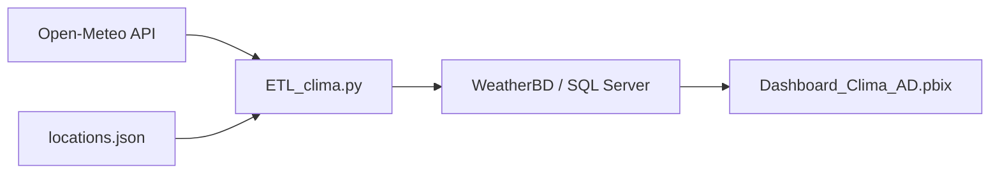
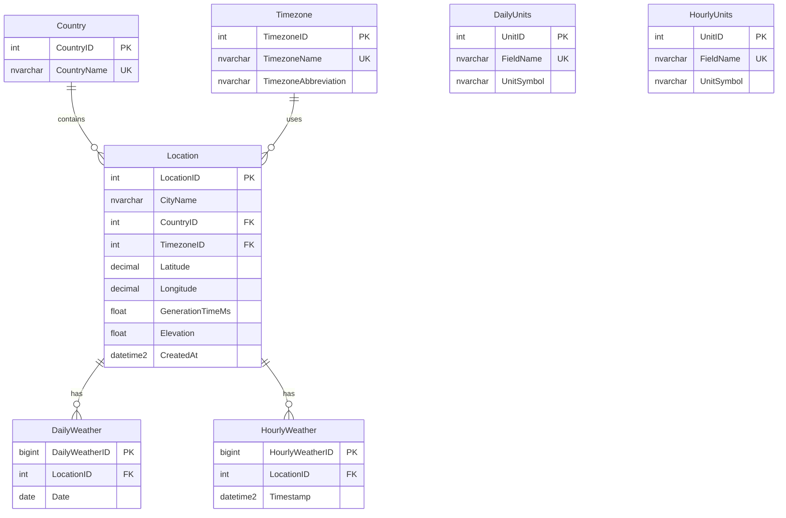

# Dash BI Clima

Pipeline de datos meteorológicos con `Python + SQL Server + Power BI` para consultar, almacenar y visualizar series climáticas históricas y de pronóstico desde Open-Meteo.

## Vista General

Este proyecto hace tres cosas:

1. Extrae datos meteorológicos desde la API de Open-Meteo.
2. Los normaliza e inserta en una base de datos SQL Server local.
3. Los consume desde Power BI para análisis y visualización.

## Arquitectura



## Estructura del Proyecto

- [ETL_clima.py](/C:/Users/d3smo/Desktop/CUC/Almacenes%20de%20datos/Dash_BI/ETL_clima.py): script ETL principal.
- [WeatherDB.sql](/C:/Users/d3smo/Desktop/CUC/Almacenes%20de%20datos/Dash_BI/WeatherDB.sql): query para la creación de la base de datos.
- [locations.json](/C:/Users/d3smo/Desktop/CUC/Almacenes%20de%20datos/Dash_BI/locations.json): catálogo de ubicaciones con ciudad, país, zona horaria y coordenadas para alimentar al API.
- [Dashboard_Clima_AD.pbix](/C:/Users/d3smo/Desktop/CUC/Almacenes%20de%20datos/Dash_BI/Dashboard_Clima_AD.pbix): dashboard de Power BI.

## Modelo de Datos

El modelo relacional actual separa país, zona horaria, ubicación y observaciones meteorológicas:



## Flujo ETL

El script [ETL_clima.py](/C:/Users/d3smo/Desktop/CUC/Almacenes%20de%20datos/Dash_BI/ETL_clima.py):

- Lee ubicaciones desde `locations.json`.
- Construye la URL de Open-Meteo con la zona horaria correcta por ubicación.
- Descarga datos diarios y horarios.
- Inserta o actualiza:
  - `Country`
  - `Timezone`
  - `Location`
  - `DailyUnits`
  - `HourlyUnits`
  - `DailyWeather`
  - `HourlyWeather`
- Reemplaza filas por fecha/hora para evitar duplicados en recargas.
- Espera entre peticiones para no sobrecargar la API.

## Requisitos

- Python 3.10 o superior
- SQL Server local
- Driver ODBC para SQL Server
- Power BI Desktop
- Librería Python:

```bash
pip install pyodbc
```

## Configuración de Base de Datos

1. Abre [WeatherDB.sql](/C:/Users/d3smo/Desktop/CUC/Almacenes%20de%20datos/Dash_BI/WeatherDB.sql) en SQL Server Management Studio.
2. Ejecuta el script para crear `WeatherBD`.

## Catálogo de Ubicaciones

El archivo [locations.json](/C:/Users/d3smo/Desktop/CUC/Almacenes%20de%20datos/Dash_BI/locations.json) define cada ubicación con esta estructura:

```json
{
  "san_jose_cr": {
    "city": "San Jose",
    "country": "Costa Rica",
    "timezone": "America/Costa_Rica",
    "latitude": 9.9281,
    "longitude": -84.0907
  }
}
```

Campos requeridos:

- `city`
- `country`
- `timezone`
- `latitude`
- `longitude`

## Ejecución del ETL

Listar ubicaciones:

```bash
python ETL_clima.py --list-locations
```

Cargar todas las ubicaciones del catálogo:

```bash
python ETL_clima.py --all-locations
```

Cargar ubicaciones específicas:

```bash
python ETL_clima.py --location san_jose_cr,berlin,madrid_es
```

Cargar coordenadas manuales:

```bash
python ETL_clima.py --coordinates "9.93,-84.09;40.71,-74.00"
```

Cambiar el rango de consulta:

```bash
python ETL_clima.py --all-locations --past-days 30 --forecast-days 7
```

Usar otra instancia de SQL Server:

```bash
python ETL_clima.py --server .\\SQLEXPRESS --database WeatherBD
```

Con autenticación SQL:

```bash
python ETL_clima.py --server localhost --database WeatherBD --username sa --password TuClave
```

## Parámetros Principales

- `--all-locations`: procesa todas las ubicaciones del catálogo.
- `--location`: procesa una o varias claves del JSON.
- `--coordinates`: permite consultar ubicaciones no definidas en el catálogo.
- `--locations-file`: cambia el archivo JSON de ubicaciones.
- `--past-days`: días históricos a consultar.
- `--forecast-days`: días futuros a consultar.
- `--request-delay`: pausa entre peticiones al API.
- `--server`, `--database`, `--username`, `--password`, `--driver`: conexión a SQL Server.

## Power BI

El dashboard [Dashboard_Clima_AD.pbix](/C:/Users/d3smo/Desktop/CUC/Almacenes%20de%20datos/Dash_BI/Dashboard_Clima_AD.pbix) consume la base `WeatherBD` y permite analizar:

- variables climáticas por ubicación
- comportamiento diario y horario
- amaneceres y anocheceres
- comparativas por país, ciudad y zona horaria

Recomendaciones para Power BI:

- Verifica que `Date`, `Timestamp`, `sunrise` y `sunset` lleguen como `Fecha` o `Fecha/Hora`.
- Si actualizas el esquema SQL, refresca el modelo en Power BI.
- Usa relaciones:
  - `Country[CountryID] -> Location[CountryID]`
  - `Timezone[TimezoneID] -> Location[TimezoneID]`
  - `Location[LocationID] -> DailyWeather[LocationID]`
  - `Location[LocationID] -> HourlyWeather[LocationID]`

## Validación Recomendada

Después de una carga, conviene revisar:

- que no todas las ubicaciones estén en `GMT`
- que `Timezone` tenga abreviaciones correctas
- que `DailyWeather` y `HourlyWeather` tengan datos por más de una ubicación
- que Power BI reconozca correctamente las columnas temporales

Ejemplo de chequeo SQL:

```sql
SELECT
    c.CountryName,
    l.CityName,
    tz.TimezoneName,
    tz.TimezoneAbbreviation
FROM Location l
JOIN Country c ON c.CountryID = l.CountryID
JOIN Timezone tz ON tz.TimezoneID = l.TimezoneID
ORDER BY c.CountryName, l.CityName;
```

## Estado del Proyecto

El proyecto ya incluye:

- base SQL estructurada para ubicaciones, países y zonas horarias
- ETL configurable por catálogo JSON
- soporte para múltiples ubicaciones y coordenadas manuales
- integración con Power BI

## Próximas Mejoras Sugeridas

- agregar `requirements.txt`
- crear vistas SQL para consumo analítico
- automatizar cargas periódicas
- incluir validaciones de calidad de datos
- separar ambientes `dev` y `prod`
